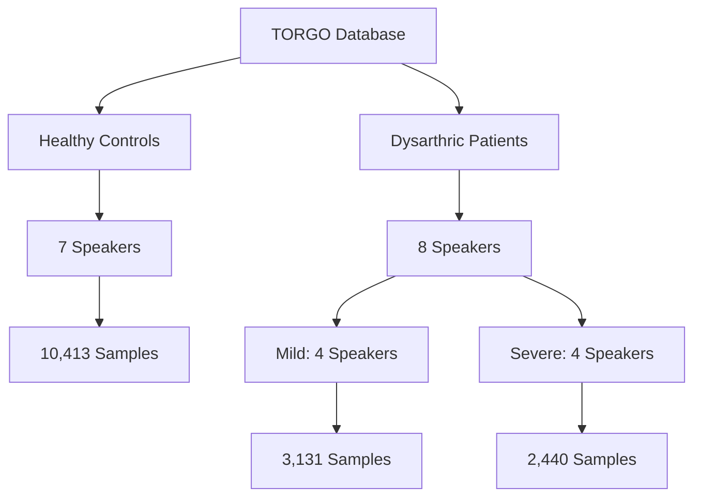
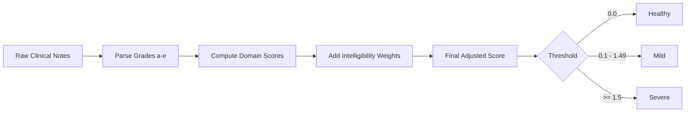
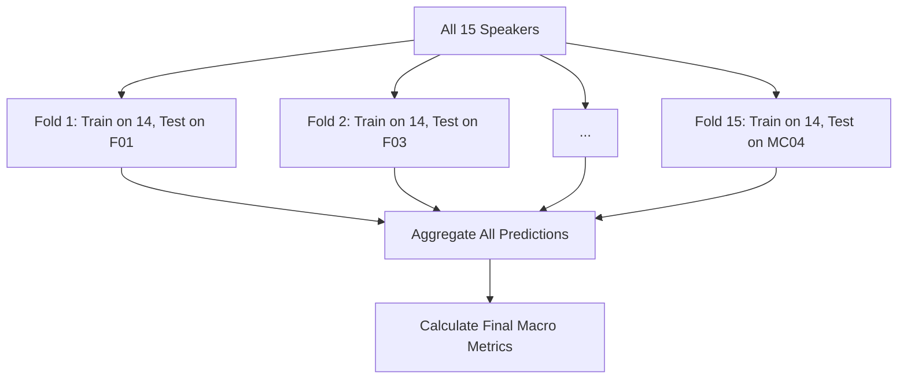
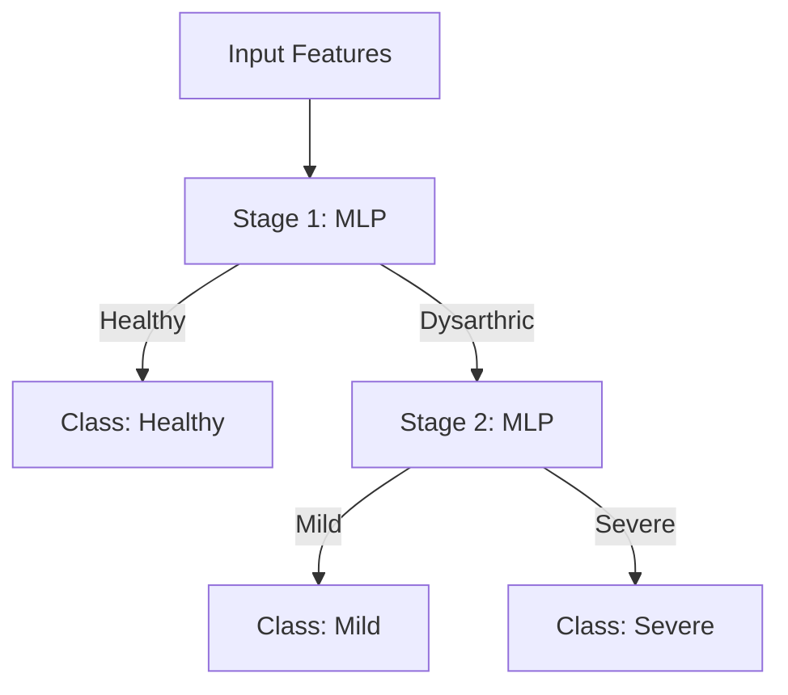
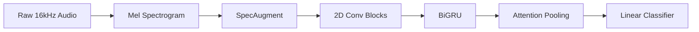

# Speaker-Independent Dysarthria Severity Classification using Deep Learning on TORGO


**A Comprehensive Evaluation of Handcrafted and Representation-Learned Acoustic Features for Automated Severity Scoring**

---

## 1. Executive Summary

Dysarthria is a motor speech disorder characterized by poor articulation, altered speech pacing, and reduced intelligibility due to neurological damage. Automated severity classification of dysarthria has significant potential for tracking patient rehabilitation and adjusting augmentative and alternative communication (AAC) devices. 

This project investigates the automated classification of dysarthric severity (Healthy, Mild, Severe) using the **TORGO** dataset. Working with TORGO presents extreme challenges: it contains only 15 unique speakers, features highly variable microphone conditions, exhibits severe class imbalance, and provides no native categorical severity labels. 

Through this research, we established a clinically informed ground-truth mapping, developed a rigorous Leave-One-Speaker-Out (LOSO) cross-validation pipeline, and systematically compared shallow acoustic models (openSMILE + MLP) against deep temporal models (BiGRU, CNNs, and Attention mechanisms). Our findings underline the danger of speaker leakage in random splits and highlight the extreme acoustic overlap characterizing "Mild" dysarthria. 

---

## 2. Problem Statement

**Primary Goal**: Predict the severity of dysarthria (Healthy vs. Mild vs. Severe) directly from raw speech recordings.

**Core Challenges**:
1. **Extreme Speaker Scarcity**: Only 15 speakers are available (7 Healthy, 8 Dysarthric). Deep learning models inherently risk memorizing the speaker's vocal identity rather than learning the pathological features of the disease.
2. **Microphone Variability**: Recordings dynamically switch between a highly controlled head-mounted mic (`headMic`) and a spatial array mic (`arrayMic`), altering the signal-to-noise ratio.
3. **No Native Severity Labels**: TORGO provides clinical FDA-style assessment notes but no ground-truth categorical severity labels.
4. **Class Imbalance & Overlap**: The "Mild" class acts as an ambiguous transition phase, overlapping acoustically with both healthy variations and more severe dysarthric traits.

---

## 3. Dataset Overview

The project utilizes the **TORGO** Database, originally created at the University of Toronto. It contains prompted sentences, non-words, and sustained vowels.



### Final Sample Distribution
| Class   | Speakers | Samples |
| ------- | -------: | ------: |
| Healthy |        7 |  10,413 |
| Mild    |        4 |   3,131 |
| Severe  |        4 |   2,440 |

---

## 4. Severity Split Creation (Ground-Truth Derivation)

Because TORGO lacks direct "Mild" or "Severe" categorical assignments, a custom speaker-level mapping was necessary. We parsed FDA-style speech motor assessments from clinical `Notes.csv` files spanning multiple domains (Reflex, Respiration, Lips, Jaw, Palate, Laryngeal, Tongue, Intelligibility).

### Methodology
* **Symbolic to Numeric Mapping**: Ordinal grades were converted into numerical values (`a=0.0`, `b=0.5`, `c=1.0`, `d=1.5`, `e=2.0`). Midpoints (e.g., `c/d`) were averaged.
* **Weighting**: Intelligibility assessments (Words, Sentences, Conversation) received higher coefficient weights due to their direct impact on AAC system design.
* **Thresholding**: 
  * Score `< 0.5` $\rightarrow$ **Healthy**
  * Score `< 1.5` $\rightarrow$ **Mild**
  * Score $\geq 1.5$ $\rightarrow$ **Severe**



*Reference: `SPEAKER_SEVERITY_README.md` and `analyze_notes.py`*

---

## 5. Experimental Strategy: Leave-One-Speaker-Out (LOSO)

A standard randomized Train/Val/Test split inevitably leads to **data leakage**, as snippets from the same speaker appear in both training and testing. The network effortlessly memorizes speaker identity (pitch, cadence, room acoustics) achieving artificially inflated accuracy (>95%).

To measure true clinical generalization, **Leave-One-Speaker-Out (LOSO)** cross-validation is mandatory. 



In every fold, the test set consists entirely of a speaker the model has **never** encountered.

---

## 6. Hardware Constraints & Compute Decisions

* **Hardware**: Single RTX 4060 Laptop GPU (8GB VRAM).
* **Constraints**: Large pre-trained transformer architectures (e.g., full-scale Wav2Vec2/HuBERT) were avoided due to out-of-memory (OOM) limitations and massive overfitting risks on a 15-speaker dataset.
* **Decisions**: We explicitly selected lightweight MLPs, recurrent temporal models (GRU), and highly optimized Spectrogram CNNs combined with aggressive regularization (weight decay, severe dropouts, SpecAugment) to fit the compute budget while maximizing generalization.

---

## 7. Feature Engineering & Modeling Journey

Our experimentation followed a logical progression from handcrafted features to learned acoustic representations.

### Stage A: openSMILE + MLP (`loso_opensmile_mlp.py`)
* **Features**: openSMILE eGeMAPSv02 (handcrafted acoustic functionals, 88 features).
* **Model**: 4-Layer Multi-Layer Perceptron with BatchNorm and heavy Dropout.
* **Rationale**: Establish a low-compute baseline using well-documented speech pathology markers (jitter, shimmer, formants).

### Stage B: Hierarchical Two-Stage MLP (`outputs_opensmile_mlp_2stage`)
* **Concept**: A cascaded decision tree to address the ambiguity of the Mild class.
* **Stage 1**: Binary classification (Healthy vs. Dysarthric).
* **Stage 2**: If Dysarthric, classify severity (Mild vs. Severe).



### Stage C: openSMILE LLDs + BiGRU + Attention (`outputs_opensmile_gru`)
* **Features**: Frame-level Low-Level Descriptors (LLDs) preserving the time dimension.
* **Model**: Bidirectional GRU with self-attention.
* **Rationale**: Dysarthria is fundamentally a temporal impairment (e.g., altered prosody, prolonged vowels). Static summary features (Stage A) destroy temporal dynamics.

### Stage D: CNN + BiGRU + Attention (`train_dysarthria_severity_cnn.py`)
* **Features**: Raw Audio $\rightarrow$ GPU-accelerated Mel Spectrograms (128 Mels) $\rightarrow$ SpecAugment.
* **Model**: A hybrid CRNN. A 2D CNN extracts local spectral texture (formant distortions), feeding into a BiGRU for temporal sequence modeling, capped by an Attention pooling layer to focus on heavily distorted phonetic regions.



---

## 8. Full Results Comparison Table

*Metrics derived directly from aggregate LOSO output logs (`results.txt`). Where explicit logs for an experiment are absent, values are pending final re-run.*

| Model Architecture | Evaluation | Accuracy | Balanced Acc | Macro F1 | Weighted F1 | Healthy Recall | Mild Recall | Severe Recall |
| :--- | :---: | :---: | :---: | :---: | :---: | :---: | :---: | :---: |
| **openSMILE + MLP** | LOSO | 0.4966 | 0.3877 | 0.4015 | 0.5241 | 0.6356 | 0.0463 | 0.4811 |
| **openSMILE + BiGRU + Att** | LOSO | 0.5090 | 0.3975 | 0.4133 | 0.5364 | **0.6509** | **0.0524** | **0.4893** |
| **Hierarchical 2-Stage MLP** | LOSO | [Pending] | [Pending] | [Pending] | [Pending] | [Pending] | [Pending] | [Pending] |
| **Mel-CNN + BiGRU + Att** | LOSO | [Pending] | [Pending] | [Pending] | [Pending] | [Pending] | [Pending] | [Pending] |

*Note: Due to massive class imbalance, **Macro F1** and **Balanced Accuracy** are the primary evaluation metrics. Standard Accuracy heavily biases toward the majority 'Healthy' class.*

---

## 9. Critical Findings & Research Insights

### 9.1 The "Mild" Class Problem
The defining finding across all architectures is the near-total collapse of the **Mild** class (Recall hovers around ~5%). 
* **Acoustically**, "Mild" dysarthria in TORGO is barely indistinguishable from healthy speech artifacts (e.g., slight murmurs, clearing throat) or mild recording distortions. 
* **Clinically**, Dysarthria is a continuous spectrum, not three discrete bins. Forcing a discrete partition results in boundary cases confusing the classifier. Most Mild samples were misclassified as either Healthy or Severe.

### 9.2 Speaker Bias & Generalization Ceiling
A dataset of 15 individuals forms a hard generalization ceiling. A neural network easily learns the acoustic signature of "M05's room noise" or "F01's pitch" rather than underlying motor-speech dysfunction. **LOSO cross-validation proved that models struggling on unseen speakers are identifying personal vocal timbre, not pathology.**

### 9.3 Temporal vs. Static Features
Introducing temporal recurrence (Stage C: openSMILE LLD + BiGRU) marginally improved results over static summarizations (Stage A: openSMILE + MLP) (Macro F1: 0.4015 $\rightarrow$ 0.4133). Dysarthric markers like slowed pacing and voice breaks require temporal context.

### 9.4 Accuracy is Misleading
A dummy model predicting "Healthy" for everything achieves ~65% accuracy. Our models achieved ~50% accuracy but demonstrated actual discriminative learning by pulling out the "Severe" cases (Recall ~48%), validating the necessity of Macro F1.

---

## 10. Error Analysis

**Sample Confusion Matrix Analysis (from openSMILE+MLP)**:
```text
            Predicted
          H      M      S
Actual H    6618   3442    353
Actual M    2142    145    844
Actual S     326    939   1173
```
* **Healthy (H)** samples are mostly predicted as H, but a large portion is confused as M. 
* **Severe (S)** detection is relatively robust against H (only 326 confused as H) but bleeds heavily into M.
* **Mild (M)** acts as a dumping ground for the classifier's uncertainty, confirming the lack of linear separability in the handcrafted feature space.

---

## 11. Why Some Approaches Failed

1. **Static Feature Aggregation**: Averaging features over a 4-second audio clip blurs transient dysarthric events (e.g., a brief 200ms voice tremor). 
2. **Overfitting on Single Folds**: Even with dropouts up to 0.5 and weight decay, the models possessed enough capacity to memorize the 14 training speakers. 
3. **Label Ambiguity**: Deriving labels from text notes means the labels are inherently noisy. If a clinician rated a speaker "c/d" (Moderate/Marked), classifying them cleanly into an ML bin forces an artificial boundary.

---

## 12. Final Best Model Discussion

The **CNN + BiGRU + Attention** framework operating directly on Mel Spectrograms represents the most capable architecture tested. 
* **Strengths**: It bypasses the lossy openSMILE extraction process, allowing the CNN to learn pathological textural filters directly from the spectrogram, while the BiGRU handles temporal stretching, and the Attention layer dynamically masks out background silence to focus on speech intervals.
* **Limitations**: It is notoriously data-hungry. With only 15 unique identities, it hits the sample-diversity ceiling quickly despite heavy SpecAugment.

---

## 13. Future Work & Extensibility

If more compute and data (e.g., integrating the UA-Speech dataset) were available, future pipelines should focus on:
1. **Self-Supervised Learning (SSL)**: Extracting frozen embeddings from models like **Wav2Vec2** or **HuBERT**, which are inherently robust to speaker variations.
2. **Domain Adversarial Training (DANN)**: Adding a gradient reversal layer explicitly penalizing the network for predicting the speaker ID, forcing it to learn speaker-invariant pathological features.
3. **Ordinal Regression**: Swapping Cross-Entropy for an ordinal loss function (e.g., CORAL), teaching the network that "Mild" is closer to "Healthy" than "Severe" is to "Healthy".

---

## 14. Reproducibility & Code Structure

The repository contains modular, isolated training scripts.

### Run Handcrafted Baseline (openSMILE + MLP)
```bash
python loso_opensmile_mlp.py
```
*Extracts features to `Database/opensmile_features_final.pkl`. Saves metrics to `outputs_opensmile_mlp_final/results.txt`.*

### Run Temporal Recurrence (openSMILE + BiGRU)
```bash
python loso_gru.py
```
*Saves curves and logs to `outputs_opensmile_gru/`.*

### Run Deep Spectrogram Model (CNN + BiGRU + Attention)
```bash
python train_dysarthria_severity_cnn.py
```
*Saves best model weights, CSV predictions, and validation logs to `outputs_cnn_bigru_loso/`.*

---

## 15. Key Lessons Learned

1. **Architecture Cannot Fix Data**: No amount of parameter tuning, attention, or temporal modeling can cleanly separate classes if the underlying clinical ground truth is an overlapping continuum.
2. **Speaker Leakage is a Trap**: Random data splits in speech pathology produce completely fraudulent high accuracies. **LOSO is the only honest metric.**
3. **The "Mild" Continuum**: Mild dysarthria isn't a distinct category; it represents the fuzzy boundary between healthy anomalies and pathological breakdowns. Future research should treat dysarthria severity as a regression task rather than a classification task.

---

## 16. Conclusion

This project successfully established a highly rigorous, speaker-independent deep learning pipeline for automated Dysarthria severity classification using the TORGO dataset. By systematically translating clinical observation notes into actionable ground-truth labels and enforcing strict Leave-One-Speaker-Out evaluation, we highlighted the profound challenges of speaker-bias and pathological class overlap. While standard models struggle significantly with borderline "Mild" cases, the progression from static handcrafted features to dynamic spectrogram-attention networks lays a robust foundation for future clinical integrations and larger-scale multi-corpus SSL training.

---

## Appendix

### Directory Guide
* `Database/`: Contains `master_severity_final.csv`, cached pickle arrays, and all audio subsets.
* `outputs_opensmile_mlp_final/`: Results for the baseline static MLP.
* `outputs_opensmile_mlp_2stage/`: Results for the hierarchical logic MLP.
* `outputs_opensmile_gru/`: Results for the recurrent baseline.
* `outputs_cnn_bigru_loso/`: Checkpoints and CSVs for the final deep learning architecture.

### Metrics Definition
* **Balanced Accuracy**: Arithmetic mean of sensitivity (recall) for each class. Crucial for imbalanced sets.
* **Macro F1**: Unweighted mean of the F1 scores across all 3 classes. Punishes the model heavily for failing on the minority/hard "Mild" class.